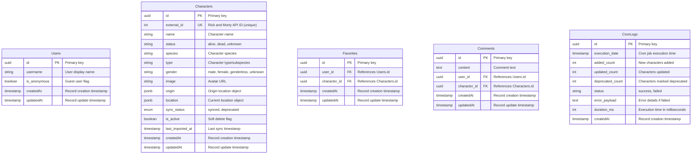

# Entity Relationship Diagram

This document describes the database schema for the Rick and Morty character management application.

## Database Overview

The application uses **PostgreSQL** with **Sequelize ORM** for data persistence. The schema supports user interactions (favorites, comments), character synchronization from the Rick and Morty API, and monitoring of data import jobs.

## ERD Diagram

## Entity Descriptions

### Users
Manages user accounts for the application. Supports both registered and anonymous users.

**Key Fields:**
- `is_anonymous`: Allows guest users to interact without registration
- Uses UUIDs for enhanced security

### Characters
Stores Rick and Morty character data synchronized from the external API.

**Key Fields:**
- `external_id`: Unique constraint ensures no duplicate imports
- `sync_status`: Tracks data freshness (`synced` = current, `deprecated` = removed from API)
- `is_active`: Soft delete flag for data retention
- `origin` & `location`: JSONB fields store nested location objects from API
- `last_imported_at`: Enables incremental sync strategies

**Indexes:**
- `external_id` (unique)
- `sync_status`
- `is_active`

### Favorites
Many-to-many relationship between Users and Characters.

**Constraints:**
- Unique constraint on `(user_id, character_id)` prevents duplicate favorites
- Cascade delete when user or character is removed

### Comments
User-generated content associated with characters.

**Features:**
- Supports anonymous and registered user comments
- Cascade delete when user or character is removed

### CronLogs
Audit trail for automated character synchronization jobs.

**Metrics Tracked:**
- Added/updated/deprecated character counts
- Execution duration
- Error details for troubleshooting
- Job status for monitoring

## Relationships

| Relationship | Type | Description |
|-------------|------|-------------|
| Users → Favorites | One-to-Many | A user can favorite multiple characters |
| Users → Comments | One-to-Many | A user can write multiple comments |
| Characters → Favorites | One-to-Many | A character can be favorited by multiple users |
| Characters → Comments | One-to-Many | A character can receive multiple comments |

## Data Synchronization Strategy

1. **Initial Import**: Fetch all characters from Rick and Morty API
2. **Incremental Updates**: Use `last_imported_at` to sync only changes
3. **Deprecation**: Mark characters as `deprecated` if removed from API
4. **Soft Delete**: Use `is_active` to retain historical data
5. **Audit Logging**: Track all sync operations in `CronLogs`

## Notes

- All timestamps use UTC
- UUIDs are used for primary keys to prevent enumeration attacks
- JSONB fields enable flexible storage of API responses without schema changes
- Soft deletes preserve data integrity for historical favorites/comments